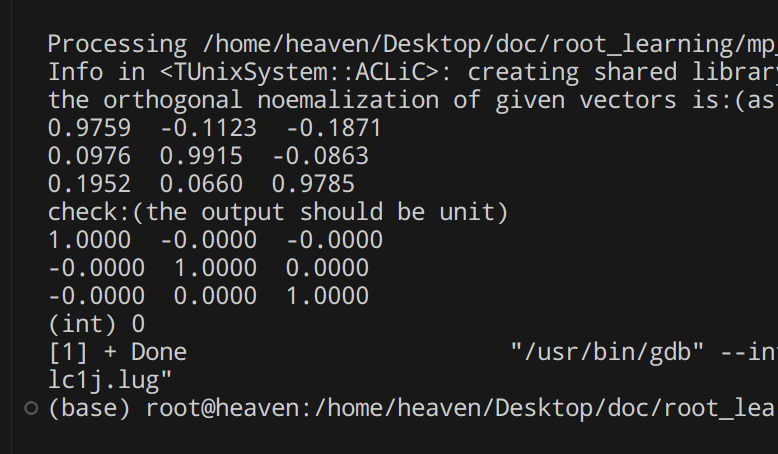
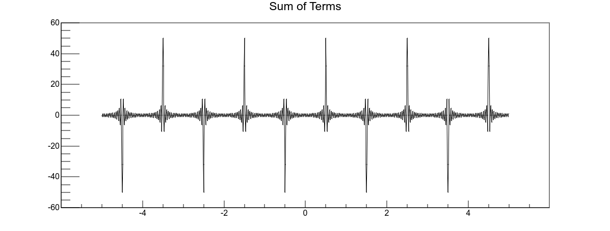
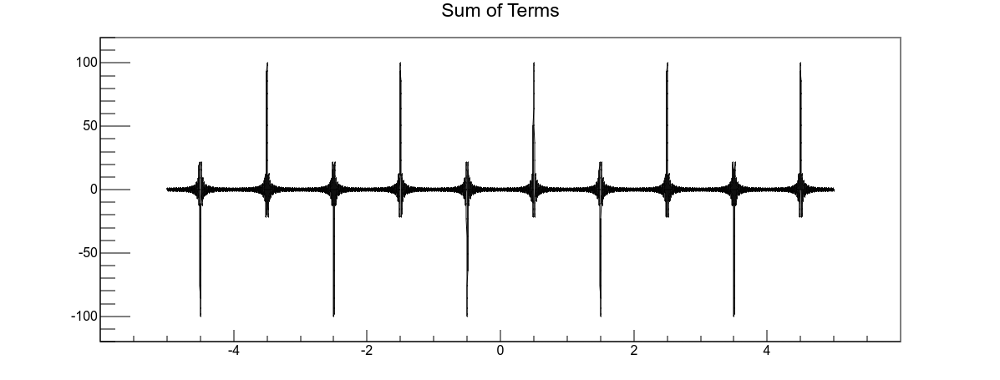
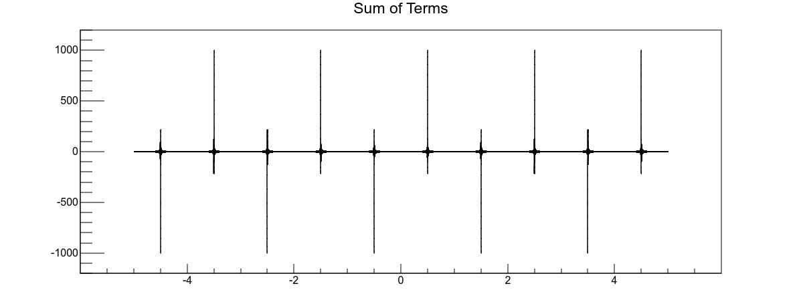
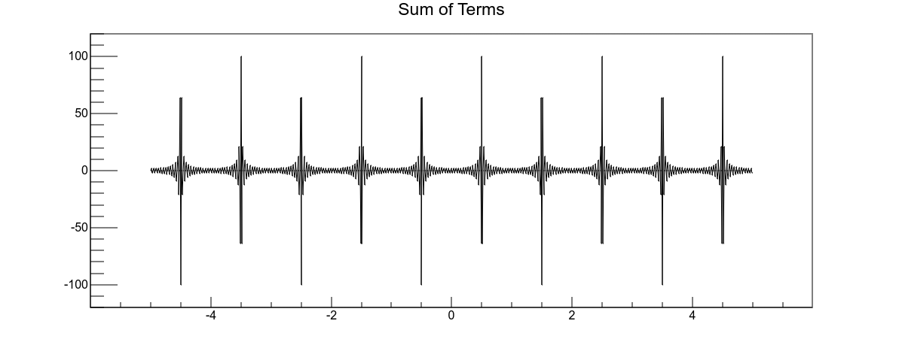
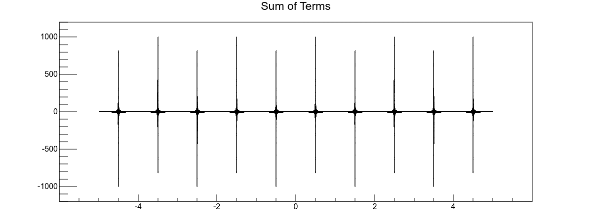

### question 1
In spherical coordinate system: $u = \left( r \quad \theta \quad \phi \right) $ and $ \left( h_{i} \right) = \left( 1 \quad r \quad r\sin \theta \right) $

the expressions for $ \Delta \psi, \Delta \frac{1}{r}, \Delta \frac{1}{r^{\alpha}} $:

we have:
1. $ \begin{aligned} \nabla \psi = \sum_{i} \mathbf{e_{i}} \frac{1}{h_{i}} \frac{\partial}{\partial u_{i}} \psi \end{aligned} $
2. $ \begin{aligned} \nabla \cdot \mathbf{A} = \frac{1}{h_{1}h_{2}h_{3}} \left[ \frac{\partial}{\partial u_{1}}\left( A_{1}h_{2}h_{3} \right) + \frac{\partial}{\partial u_{2}}\left( A_{2}h_{3}h_{1} \right) + \frac{\partial}{\partial u_{3}}\left( A_{3}h_{1}h_{2} \right) \right] \end{aligned} $ 

so 
$ \begin{aligned} \Delta \psi = \frac{1}{h_{1}h_{2}h_{3}} \left[ \frac{\partial}{\partial u_{1}}\left( \frac{h_{2}h_{3}}{h_{1}} \frac{\partial}{\partial u_{1}} \psi \right) + \frac{\partial}{\partial u_{2}}\left( \frac{h_{3}h_{1}}{h_{2}} \frac{\partial}{\partial u_{2}} \psi \right) + \frac{\partial}{\partial u_{3}}\left( \frac{h_{1}h_{2}}{h_{3}} \frac{\partial}{\partial u_{3}} \psi \right) \right] \end{aligned} $

and for the spherial coordinate system:
$$ \begin{aligned} \Delta \psi &= \frac{1}{r^{2}\sin \theta} \left[ \frac{\partial}{\partial r}\left( r^{2}\sin \theta \frac{\partial}{\partial r} \psi \right) + \frac{\partial}{\partial \theta}\left( \sin \theta \frac{\partial}{\partial \theta} \psi \right) + \frac{\partial}{\partial \phi}\left( \frac{1}{\sin \theta} \frac{\partial}{\partial \phi} \psi \right) \right]  \\ &= \frac{1}{r^2} \frac{\partial}{\partial r} \left( r^2 \frac{\partial \psi}{\partial r} \right) + \frac{1}{r^2 \sin \theta} \frac{\partial}{\partial \theta} \left( \sin \theta \frac{\partial \psi}{\partial \theta} \right) + \frac{1}{r^2 \sin^2 \theta} \frac{\partial^2 \psi}{\partial \phi^2} \\ &= \frac{\partial^{2}}{\partial r^{2}} \psi + \frac{2}{r}\frac{\partial}{\partial r} \psi + \frac{1}{r^{2}}\cot \theta \frac{\partial}{\partial \theta} \psi + \frac{1}{r^2 \sin^2 \theta} \frac{\partial^2 \psi}{\partial \phi^2} \end{aligned} 
$$

change $ \psi $ to $ \frac{1}{r} $ and $ \frac{1}{r^{\alpha}} $:
1. $ \begin{aligned} \Delta \frac{1}{r} = 0 \left( r \neq 0 \right) \end{aligned} $
2. $ \begin{aligned} \Delta \frac{1}{r^{\alpha}} = \frac{\alpha \left(\alpha-1\right)}{r^{\alpha+2}} \left( r \neq 0 \right) \end{aligned} $

Then, we'll calculate them when r = 0, we calculate $ \Delta \frac{1}{r^{\alpha}} $ and when $ \alpha  = 1 $, it's $ \Delta \frac{1}{r} $.

$$
\begin{aligned}
\int_{V} \Delta \frac{1}{r^{\alpha}} \,dx  &= \lim_{a \rightarrow 0} \int_{V} \Delta \frac{1}{\left(r^{\alpha}+a^{\alpha}\right)^{\frac{1}{\alpha}}} \,dV \\
&=-\lim_{a \rightarrow 0} \int \,d\Omega \int_{0}^{\infty} \left(\frac{\left(\alpha+1\right)a^{\alpha}r^{\alpha}}{\left(r^{\alpha}+a^{\alpha}\right)^{\frac{1}{\alpha}+2}} \right) \,dr \\
&=-4\pi \int_{0}^{\infty} \frac{\left(\alpha+1\right)\rho^{\alpha}}{\left(\rho^{\alpha}+1\right)^{\frac{1}{\alpha}+2}} \,d\rho, \quad where \quad \rho = ar. \\
&= 4\pi \int_{0}^{\infty} \rho \,d\left(\frac{1}{\left(\rho^{\alpha}+1\right)^{\frac{1}{\alpha}+1}}\right) \\
&= 4\pi \left[\frac{\rho}{\left(\rho^{\alpha}+1\right)^{\frac{1}{\alpha}+1}}\vert_{0}^{\infty} - \int_{0}^{\infty} \frac{1}{\left(\rho^{\alpha}+1\right)^{\frac{1}{\alpha}+1}} \,d\rho \right] \\
&= -4\pi \frac{2}{\alpha}\int_{0}^{\frac{\pi}{2}} \sin^{\frac{2}{\alpha}-1} \theta \cos \theta \,d\theta, \quad where \quad \rho^{\alpha} = \tan^{2} \theta. \\
&= -4\pi \frac{1}{\alpha}\frac{\Gamma\left(\frac{1}{\alpha}\right)\Gamma\left(1\right)}{\Gamma\left(\frac{1}{\alpha}+1\right)} \\
&=-4\pi \frac{1}{\alpha}\frac{\Gamma\left(\frac{1}{\alpha}\right)\Gamma\left(1\right)}{\frac{1}{\alpha} \Gamma\left(\frac{1}{\alpha}\right)} \\
&=-4\pi
\end{aligned}
$$

so$\begin{aligned} \Delta \frac{1}{r} = -4\pi \delta\left(\mathbf{r}\right) \end{aligned}$,as $\Delta \frac{1}{r} = 0 $, when $r \neq 0 $.

But for others, the integral can be divided into two parts: $0 \rightarrow a, a \rightarrow \infty \left(a \rightarrow 0 \right) $. When $\alpha \neq 0 or 1 $, the notation of the answers is different, but they're all infinity. So the question may not be defined till now.

### question 2
we have three vectors: 
$\begin{aligned} &\left(1 \quad 0.1 \quad 0.2 \right)^{\intercal} \\ &\left(-0.2 \quad 1 \quad 0.05 \right)^{\intercal} \\ &\left(0.1 \quad 0.1 \quad 1 \right)^{\intercal}   \end{aligned}$

do these:
1. orthogonal normalization them
2. check them

the pseudocode is listing below:
```
BEGIN
  // Initialize matrix A with given values
  A = [ [1, -0.2, 0.1],
        [0.1, 1, 0.1],
        [0.2, 0.05, 1] ]

  // Initialize identity matrix I with zeros
  I = 3x3 matrix of zeros

  // Schmidt orthogonalization process
  FOR i FROM 1 TO N-1 DO
    FOR j FROM 0 TO i-1 DO
      // Calculate the dot product 'up' between vectors i and j
      up = dot(A[:, i], A[:, j])
      
      // Calculate the squared norm 'down' of vector j
      down = dot(A[:, j], A[:, j])
      
      // Update vector i to be orthogonal to vector j
      IF down != 0 THEN
        A[:, i] = A[:, i] - (up / down) * A[:, j]
      END IF
    END FOR
  END FOR

  // Normalize each vector in A
  FOR i FROM 0 TO N-1 DO
    // Calculate the norm 'mod' of vector i
    mod = sqrt(dot(A[:, i], A[:, i]))
    
    // Update vector i to be a unit vector
    A[:, i] = A[:, i] / mod
  END FOR

  // Output the orthogonal and normalized matrix A
  PRINT "Orthogonal and normalized matrix A:"
  PRINT A

  // Check: Calculate the dot products to form matrix I
  FOR i FROM 0 TO N-1 DO
    FOR j FROM 0 TO N-1 DO
      I[i, j] = dot(A[:, i], A[:, j])
    END FOR
  END FOR

  // Output matrix I, which should be close to the identity matrix
  PRINT "Check matrix I:"
  PRINT I
END
```

the result is:


### question 3
draw the picture of $\begin{aligned}\delta \left(\mathbf{x}-\mathbf{x^{\prime}}\right) = \frac{2}{l} \sum_{k=1}^{\infty} \sin \frac{k\pi}{l} x^{\prime} \sin \frac{k\pi}{l} x \end{aligned}$.

let a = 0.5 and l = 1
the pseudocode is listing below:
```
BEGIN
  FUNCTION calculateAndPlot(DOUBLE a)
    CONSTANT kMax = 50
    CONSTANT nPoints = 1000
    xMin = -5.0
    xMax = 5.0
    dx = (xMax - xMin) / nPoints
    DOUBLE x[nPoints]
    DOUBLE ySum[nPoints]

    FOR i FROM 0 TO nPoints - 1 DO
      x[i] = xMin + i * dx
      ySum[i] = 0.0
    END FOR

    FOR k FROM (1 + 50) TO (kMax + 100) DO
      FOR i FROM 0 TO nPoints - 1 DO
        DOUBLE term = 2.0 * SIN(k * PI() * a) * SIN(k * PI() * x[i])
        ySum[i] = ySum[i] + term
      END FOR
    END FOR

    CREATE TGraph* graph WITH nPoints, x, ySum
    graph.SetTitle("Sum of Terms")

    CREATE TCanvas* canvas WITH "canvas", "Sum of Terms", 800, 600
    graph.Draw("AL")

    STRING fileName = FORMAT("sum_graph_a_%.2f.root", a)
    CREATE TFile* outputFile WITH fileName, "RECREATE"
    graph.Write()
    outputFile.Close()

    DELETE graph
    DELETE canvas
  END FUNCTION

  FUNCTION delta()
    DOUBLE a = 0.5
    calculateAndPlot(a)
  END FUNCTION

  CALL delta()
END
```

1. k: 1 to 10 
2. k: 1 to 50 
3. k: 1 to 100 
4. k: 1 to 10 
5. k: 50 to 100 
6. k: 1000 to 2000 